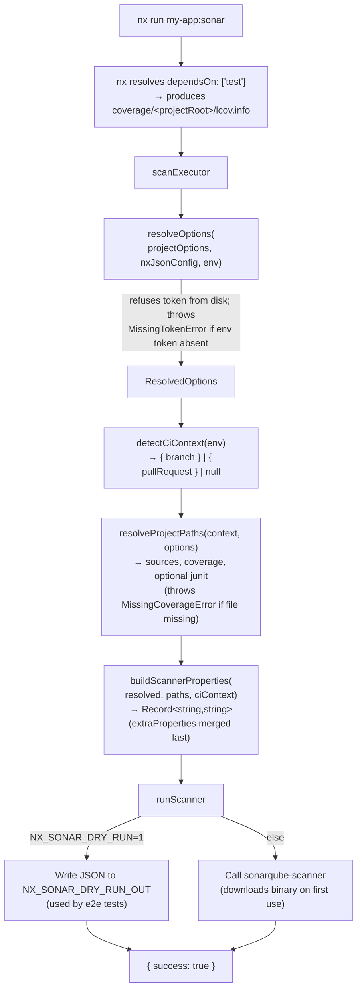

# Architecture

This document explains how `@itssky/nx-sonar` is put together. If you're contributing a fix or a feature, start here.

The plugin has one job: turn a per-project `nx run my-app:sonar` invocation into a SonarQube/SonarCloud scan, with sensible defaults, three layers of configuration, and zero extra installs. Everything else is in service of that.

## High-level shape

```
@itssky/nx-sonar
├── 1 executor       — scan       (the user-facing command)
├── 2 generators     — init, configuration  (setup)
└── 7 utility modules                       (pure logic, one job each)
```

The executor is a **thin orchestrator**: it doesn't decide anything itself, it just composes the utilities in the right order, then hands a property bag to the only impure module that actually invokes the Sonar scanner. The generators are nx `Tree`-based file editors with no runtime dependency on the executor.

## Module layout

```
nx-sonar/src/
├── executors/scan/
│   ├── executor.ts                  # orchestrator — composes utils, returns ExecutorResult
│   ├── executor.spec.ts
│   ├── schema.json                  # what nx validates target options against
│   └── schema.d.ts                  # TS type for the same
│
├── generators/
│   ├── init/                        # workspace-level setup (run once)
│   │   ├── generator.ts
│   │   ├── generator.spec.ts
│   │   ├── schema.json
│   │   └── schema.d.ts
│   └── configuration/               # per-project setup (run per nx project)
│       ├── generator.ts
│       ├── generator.spec.ts
│       ├── schema.json
│       └── schema.d.ts
│
└── utils/
    ├── types.ts                     # shared types — ScanExecutorOptions, ResolvedOptions, CiContext, …
    ├── errors.ts                    # typed errors with actionable messages
    ├── resolve-options.ts           # 3-layer merge + token policy
    ├── detect-ci-context.ts         # GH/GitLab/CircleCI/Bitbucket env → branch | PR | null
    ├── detect-test-runner.ts        # read project test target → jest | vitest | other | none
    ├── resolve-project-paths.ts     # sources / coverage / junit paths from project graph
    ├── build-scanner-properties.ts  # final flat Record<string,string> for the scanner
    └── run-scanner.ts               # the only impure module — calls sonarqube-scanner (or dry-run hook)
```

Each utility is **pure** (input → output, no I/O, no globals) except `run-scanner.ts`, which is the single I/O boundary. This is what makes the test suite fast and the executor easy to reason about.

## Executor data flow



### What each step is responsible for

| Step | Module | Pure? | What it produces |
| --- | --- | --- | --- |
| 1 | `nx` (dependsOn) | — | `coverage/<projectRoot>/lcov.info` |
| 2 | `resolveOptions` | ✅ | `ResolvedOptions` — merged config with the token attached. Throws if `SONAR_TOKEN` is missing or a `token` field is found in `nx.json`/`project.json`. |
| 3 | `detectCiContext` | ✅ (env passed in) | `CiContext` describing branch or PR, or `null` if not in CI. |
| 4 | `resolveProjectPaths` | ✅ | `ResolvedPaths` — sources, coverage path (existence-checked), optional junit report (warn + omit if missing). |
| 5 | `buildScannerProperties` | ✅ | Flat `Record<string,string>` ready to hand to the scanner. `extraProperties` is spread last so users can override anything. |
| 6 | `runScanner` | ❌ — only I/O module | Invokes `sonarqube-scanner` and returns `{ success }`. Honours `NX_SONAR_DRY_RUN=1` for e2e (writes the property bag to `NX_SONAR_DRY_RUN_OUT` instead of calling the binary). |

## Configuration layering

`resolveOptions` is the single source of truth for "what does the executor actually use?" — and it follows a strict precedence chain:

```
project.json target options  >  nx.json → nxSonar  >  environment variable  >  built-in default
```

Example: `hostUrl`.

| Where it's set | Wins when |
| --- | --- |
| `apps/my-app/project.json` → `targets.sonar.options.hostUrl` | per-project override (always wins if present) |
| `nx.json` → `nxSonar.hostUrl` | workspace-wide default for all projects |
| `SONAR_HOST_URL` env var | unset in config (typically used by CI to switch envs) |
| `https://sonarcloud.io` | nothing else specified |

**One exception:** `token` is **never** read from `nx.json` or `project.json`. It comes from `SONAR_TOKEN` only. If `resolveOptions` finds a `token` key in either disk-config layer, it throws `TokenInDiskConfigError` and refuses to run — the message tells the user to remove it from the file and use the env var instead. This is enforced both at runtime in the executor and verified by an e2e scenario.

## Error handling

All errors raised inside the plugin extend `NxSonarError`. The executor's outer catch turns those into `{ success: false }` with a friendly `console.error` message. Anything else (a programmer error, an unexpected throw from a third-party module) propagates as-is so nx's reporter shows the stack trace.

| Error | When | Fix the message suggests |
| --- | --- | --- |
| `MissingTokenError` | `SONAR_TOKEN` env var is unset or blank | Generate a token in Sonar and export it (or set as a CI secret) |
| `TokenInDiskConfigError` | `token` found in `nx.json` or `project.json` | Remove from the file; use `SONAR_TOKEN` env var |
| `MissingCoverageError` | LCOV file not found at the resolved path | Configure jest/vitest to emit `lcov`, or set `coverageLcovPath` |
| `InvalidConfigError` | Required option (e.g. `projectKey`) couldn't be resolved from any layer | Set it where the message indicates |

Every error message names *what to do*, not just *what's wrong* — this is a hard convention in the codebase.

## Design principles

1. **One responsibility per file.** Each `utils/*.ts` does exactly one thing. If you find yourself adding a second concern to a util, split it.
2. **Pure where possible, impure on purpose.** Only `run-scanner.ts` does I/O. Everything else takes its inputs as arguments — that's what makes the unit tests trivially fast (62 tests, ~5 s on a laptop) and the executor easy to mock for e2e.
3. **The executor is composition, not logic.** If a code review surfaces business logic creeping into `scan/executor.ts`, that logic belongs in a util.
4. **Errors are typed and actionable.** No `throw new Error("something went wrong")`. Always a `NxSonarError` subclass with a fix-it message.
5. **The dry-run hook is the only test-only branch.** `run-scanner.ts` is the one place the e2e harness reaches into runtime behaviour, and even there the env var (`NX_SONAR_DRY_RUN`) is the only special path — everything upstream of `run-scanner` is exercised exactly as it runs in production.

## Testing strategy

- **Unit tests** (Jest, co-located `*.spec.ts`). Generators run against an in-memory `Tree` from `@nx/devkit/testing`. The executor mocks `runScanner` and asserts on the property bag.
- **E2e tests** (`nx-sonar-e2e/`). Scaffold a fresh nx workspace, install the locally-built plugin tarball from a verdaccio registry, run the generators and the executor, assert on either the dry-run output JSON (happy path) or the error stream (failure paths).
- **Coverage floor:** 80% statements per package; CI fails below.

## Want to change something?

| If you want to … | Touch this file |
| --- | --- |
| Add a new executor option | `utils/types.ts` + `executors/scan/schema.json` + the resolver/builder pair |
| Add a new CI provider for branch/PR detection | `utils/detect-ci-context.ts` + its spec |
| Pass a new `sonar.*` property | `utils/build-scanner-properties.ts` (or the user's `extraProperties` if it's truly user-specific) |
| Change error wording | `utils/errors.ts` |
| Change generator output | the corresponding `generators/<name>/generator.ts` |

Anything else — open a [discussion](https://github.com/xItsSky/nx-sonar/discussions) before you start. We'll happily help you find the right place to land it.
